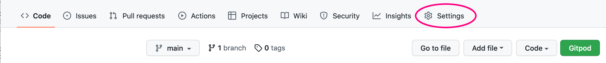
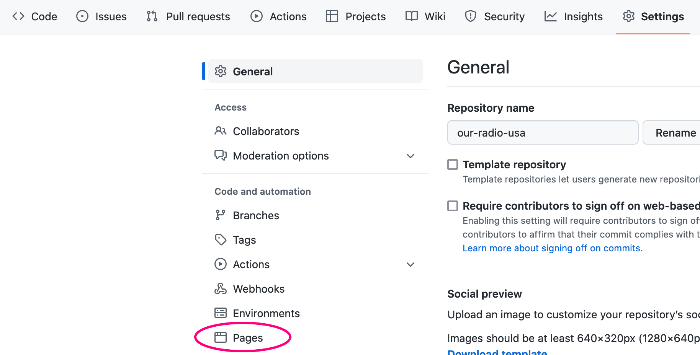
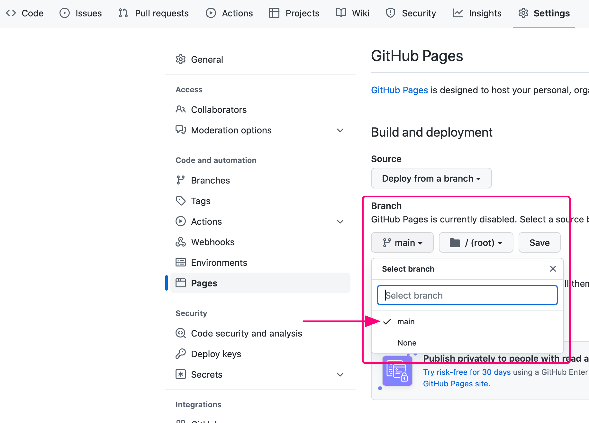
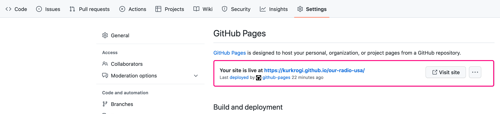

# Our Radio USA Project

Our Radio USA is a website for people who emigrated to abroad and would like to hear live streamed radio from their homeland. Modern technology of audio streaming allows them to have access to this radio service from any place all over the world, any time on any device. This allows listeners to be in touch with current affairs of their country so they can relate to them in conversations with their families and friends home.

## Features

### **Implemented Features**

1. **Navigation Bar**
- The purpose of this element is to display website logo acting as and identity element and a link to the home page, and most importantly allow the user to easily navigate through the website pages.
- This feature is repeated on all pages and additionally helps to identify current location on the website by highlighting corresponding link.
- By having this feature available on all pages the need to use browsers navigation mechanism is eliminated, especially on mobile devices.

2. **The Home Page**
**[UX considerations](#ux-considerations)** indicated that the most important functionality is the access to the radio stream and this is implemented on the home page of this application. This page consists of two features which allow the user to do this in easy and unobstructed way.
- The above the fold section of home page includes an animated image with a CTA element which is a Play widget. The widget allows to start and pause playing the radio.  
This section also includes a secondary CTA button which gets the user to the below section of the home page with additional methods of accessing the radio.
- Below the fold section lists available mobile applications with which the radio can be listened to.

3. **The Footer**
The footer feature displays links to the radio's social media and repeats links to two other features: contact form and programme guide

4. **Programme Guide Page**
This feature displays radio programming in a tabular form
5. **Contact Page**
This page allows user to send a message to the radio staff by filling in a contact form

### **Features Left to Implement**
The following features need to be implemented to fulfil [Scope Plane](#scope-plane) decisions.

1. A page showing short profiles of the radio staff
2. An programmes archive page to give access to previous programmes, interviews and cyclical programmes.
3. Comment/testimony section

## **Testing**

*Describe what tests where done, what bugs were detected and addressed or not. Responsiveness, links, images*

- cross-browser testing
- cross-platform testing

### Bugs fixed

- Missing blank lines was causing wrong display of README.md file in browser.

### **Validation**

- HTML validation
- CSS validation
- SVG graphics was validated with https://validator.w3.org/check and passed the validation without errors or warnings.

## **Deployment**

To deploy this application please follow these steps:

1. In the GitHub repository click `Settings`

2. On the list on the left click `Pages`

3. Select the `main` branch and press the `Save` button

4. Refresh the page and follow the link after words **Your site is live at**

## **Credits**

*This section will list all the media sources, code inspiration and guides followed in order to create the website.*

## **UX Considerations**

The following decisions were made after considering the UX aspect of the website in accordance with 5 Planes of UX:

### **Strategy Plane**  

The purpose of the website/application is to give access to a live streamed internet radio to it's target audience. The profile of the radio is an emigration oriented and the main purpose is to give access to people all other the world living in different time zones. The contents of the radio programming is outside of the scope of this website but **Scope Plane** lists features which make some of these goals possible.

### **Scope Plane**  

The basic features which need to be implemented to achieve the MVP are as follows:

- Creation of navigation bar to allow access to different website functions
- Easy access to the radio live stream
- List of radio programmes schedule
- Allow listeners to contact the radio

Extended features to implement are:

- Give access to past programmes to allow listeners from different time zones to listen at time convenient to them (archive)
- Showcase authors and staff profiles, with photos in order to create better connection with listeners
- Feature to allow posting comments/testimonies to create the *alive and connected* vibe

### **Structure Plane**

- The most important feature is the 'listen live' function, this is implemented on the Home Page
- The 'Programming' information is less important and is the secondary information, presented on a separate page.
- The third order of importance is the 'Contact' form, presented on another separate page.

### **Skeleton & Surface Plane**

Having the above in mind two high resolution prototypes were created in Adobe XD to ilustrate the concepts and layout.

- [Mobile phone layout prototype](https://xd.adobe.com/view/f625b5e9-6879-4303-9832-15503cf1e178-a376/?fullscreen) was created first because listeners on mobile phones are very likely the biggest audience for the service.
- [Desktop layout prototype](https://xd.adobe.com/view/3c15a152-6176-4b54-9c93-5586255d348f-6946/?fullscreen) was created next to illustrate service responsive bahaviour of the service on bigger screen.