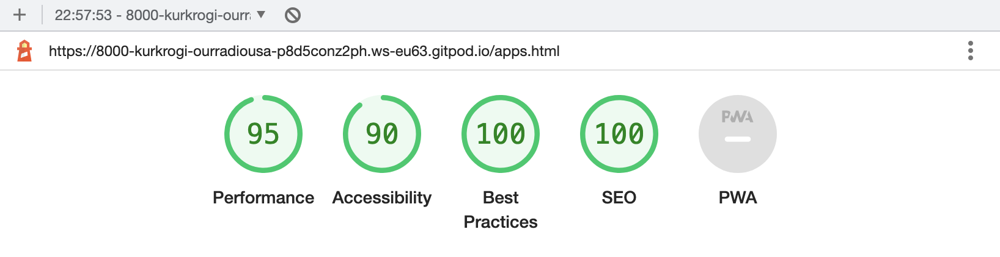

# Our Radio USA Project

[Our Radio USA](https://kurkrogi.github.io/our-radio-usa/) is a website for people who emigrated to abroad and would like to hear live streamed radio from their homeland. Modern technology of audio streaming allows them to have access to this radio service from any place all over the world, any time on any device. This allows listeners to be in touch with current affairs of their country so they can relate to them in conversations with their families and friends home.

## Features

### **Implemented Features**

1. **Navigation Bar**
- The purpose of this element is to display website logo acting as and identity element and a link to the home page, and most importantly allow the user to easily navigate through the website pages.
- This feature is repeated on all pages and additionally helps to identify current location on the website by highlighting corresponding link.
- By having this feature available on all pages the need to use browsers navigation mechanism is eliminated, especially on mobile devices.

2. **The Home Page**
**[UX considerations](#ux-considerations)** indicated that the most important functionality is the access to the radio stream and this is implemented on the home page of this application. This page consists of two features which allow the user to do this in easy and unobstructed way.
- The above the fold section of home page includes an animated image with a CTA element which is a Play widget. The widget allows to start and pause playing the radio.  
This section also includes a secondary CTA button which gets the user to the below section of the home page with additional methods of accessing the radio.
- Below the fold section lists available mobile applications with which the radio can be listened to.

3. **The Footer**
The footer feature displays links to the radio's social media and repeats links to two other features: contact form and programme guide

4. **Programme Guide Page**
This feature displays radio programming in a tabular form

5. **Contact Page**
This page allows user to send a message to the radio staff by filling in a contact form

6. **App Page**
This feature presents the user with alternative ways to enjoy the radio: Android and iPhone apps.

### **Features Left to Implement**
The following features need to be implemented to fulfil [Scope Plane](#scope-plane) decisions.

1. A page showing short profiles of the radio staff
2. An programmes archive page to give access to previous programmes, interviews and cyclical programmes.
3. Comment/testimony section

## **Testing**

I tested the website in Firefox, Safari, Chrome and Edge browsers. Both responsiveness and integrity of the layouts were checked. The website worked in all four browsers without any problems.

I confirmed that all texts a legible in both the mobile and desktop versions. 

I checked every link and confirmed that all external links open in a new widow with the exeption of the mail link which opens default email client to allow user to complete the task.

The contact form was tested by entering information in relevant fields and confirming that the information was correctly passed over to the https://formdump.codeinstitute.net/ service. Next I checked if the browser flags user for not filling in all required input fields in the form. The opposite was also tested - I checked that not required inputs, the check buttons in contact reference sections are not flagged when user doesn't select any of them.

### Bugs fixed

- Missing blank lines was causing wrong display of README.md file in browser.
- URL to background image of the contact page was wrong (not relative to styles.css). This work OK for some reason in gitpod environment but not on github.

### **Validation**

#### **HTML, CSS & SVG**
All pages were tested with W3C validators:

- [Markup validator](https://validator.w3.org/#validate_by_input)
- [CSS validatior](https://jigsaw.w3.org/css-validator/#validate_by_input)

Additionally all SVG images were validated with the same [Markup validator service](https://validator.w3.org/#validate_by_upload)

All test passed.

#### **Accessibility*

Accessibility was tested with the Chrome's Litehouse feature and high scores were achieved on all pages. These are results for mobile version of pages but similar scores were achieved with desktop layout.

**Home page**

**Schedule page**

**Contact page**

**Apps page**

## **Deployment**

To deploy this application please follow these steps:

1. In the GitHub repository click `Settings`

2. On the list on the left click `Pages`

3. Select the `main` branch and press the `Save` button

4. Refresh the page and follow the link after words **Your site is live at**

## **Credits**

- The code for the radio streaming service widget is supplied by the [provider](https://radio.co) and there's very limited control over it.
- Images come from [Freepik](https://www.freepik.com)
- Music played on the stream comes from https://freemusicarchive.org
- The colour palette was created with [Coolors](coolors.co)
- Font used is Kanit from [Google Fonts](https://fonts.google.com/)
- [Font Awesome](https://fontawesome.com/) icons were used for media links in the footer

## **Acknowledgements**

- Triangles indicating current page are created following this [CSS Tricks Guide](https://css-tricks.com/snippets/css/css-triangle/)

## **UX Considerations**

The following decisions were made after considering the UX aspect of the website in accordance with 5 Planes of UX:

### **Strategy Plane**  

The purpose of the website/application is to give access to a live streamed internet radio to it's target audience. The profile of the radio is an emigration oriented and the main purpose is to give access to people all other the world living in different time zones. The contents of the radio programming is outside of the scope of this website but **Scope Plane** lists features which make some of these goals possible.

### **Scope Plane**  

The basic features which need to be implemented to achieve the MVP are as follows:

- Creation of navigation bar to allow access to different website functions
- Easy access to the radio live stream
- List of radio programmes schedule
- Allow listeners to contact the radio

Extended features to implement are:

- Give access to past programmes to allow listeners from different time zones to listen at time convenient to them (archive)
- Showcase authors and staff profiles, with photos in order to create better connection with listeners
- Feature to allow posting comments/testimonies to create the *alive and connected* vibe

### **Structure Plane**

- The most important feature is the 'listen live' function, this is implemented on the Home Page
- The 'Programming' information is less important and is the secondary information, presented on a separate page.
- The third order of importance is the 'Contact' form, presented on another separate page.

### **Skeleton Plane**

Having the above in mind two high resolution prototypes were created in Adobe XD to illustrate the concepts and layout.

- [Mobile phone layout prototype](https://xd.adobe.com/view/f625b5e9-6879-4303-9832-15503cf1e178-a376/?fullscreen) was created first because listeners on mobile phones are very likely the biggest audience for the service.
- [Desktop layout prototype](https://xd.adobe.com/view/3c15a152-6176-4b54-9c93-5586255d348f-6946/?fullscreen) was created next to illustrate service responsive behaviour of the service on bigger screen.

As the most important feature is the radio stream player it was placed on the home page, above the fold together with main navigation in the header section.

Additionally a secondary navigation elements were added both in the above the fold section, to indicate further content below and at the bottom of the footer to allow quick return to main navigation in the page header.

Information about the radio profile was also placed on the main page but below the fold as it's considered secondary. A link in the main navigation area allows quick access to it.

Subsequent pages are dedicated to only one topic and follow the same pattern as the home page, sharing the same header with navigation and footer. The content of schedule page is split into two columns with information about daily programming on left and weekday specials presented in separate column. 

### **Surface Plane**

As mobile phone users are considered the most important target of the website following decisions were made:

- Vivid colours were selected with strong contrast in order attract user attention to important elements of the website. This is to create lively atmosphere and create warm friendly feelings and welcoming atmosphere.
- A sans-serif font with large small letters (in relation to capital letters) was chosen to give users using mobile devices better experience and easier to read text.
- Small sizes of fonts were avoided, especially in interactive elements, i.e. navigation.
- Large background images were not used for mobile layout, they appear only in the desktop version.
- SVG images were used where possible to reduce download size and also to benefit from they scalability and achieve crisp sharp picture on high resolution screens.
